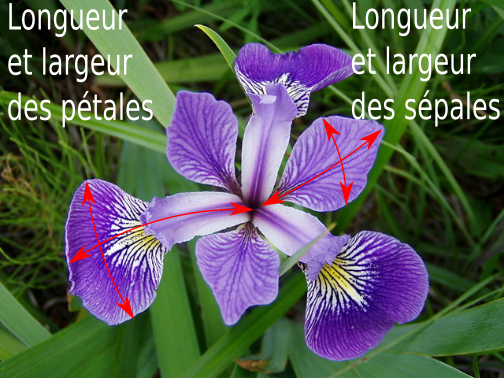

Activité: algorithme kNN
========================

.. rubric:: Présentation du problème
   :class: margin-bottom-16

En 1936, le statisticien britannique Ronald Fisher a utilisé un jeu de données basé sur 150 fleurs d'iris, appartenant à 3 variétés différentes : Setosa, Versicolor et Virginica. Il souhaitait pouvoir déterminer la variété d'une fleur d'iris prélevée au hasard dans la nature.

.. list-table::
   :class: text-align-center

   *  -  .. figure:: ../img/Iris_setosa_1.jpg
            :align: center
            :width: 200

      -  .. figure:: ../img/Iris_virginica_1.jpg
            :align: center
            :width: 200

      -  .. figure:: ../img/Iris_versicolor_1.jpg
            :align: center
            :width: 200

   *  -  Iris Setosa
      -  Iris Virginica
      -  Iris Versicolor

#. En examinant seulement les photos ci-dessus, donner quelques critères discriminants qui permettraient de classifier les fleurs d'iris.
#. En vous aidant de la photo ci-dessous, préciser quelles sont les caractéristiques des fleurs mesurées par Fisher.

.. rubric:: Étude du problème à résoudre
   :class: margin-bottom-16

Le fichier ``iris.csv`` contient les relevés des 150 iris effectués par Ronald Fisher. Vous trouverez ce fichier sur l'ENT dans la partie **Algorithme des plus proches voisins** (moodle).

L'objectif de cette partie est d'exploiter et représenter graphiquement ce jeu de données en Python.

On rappelle quelques fonctions utiles à l'écriture de notre script.

- ``with open("iris.csv",mode='r',encoding='utf8',newline='') as f:`` permet d'ouvrir un fichier en lecture pour en extraire les données. Ici l'ouverture se fait avec l'alias ``f``.
- ``data = csv.reader(f,delimiter=',')`` permet de transformer les données du fichier ``csv`` en listes.
- ``from matplotlib import pyplot`` pour importer le module ``pyplot`` du module ``matplotlib``. Ce module permet de représenter graphiquement des données.
- ``pyplot.scatter(x, y, c='couleur')`` pour placer les points de coordonnées :math:`(x;y)`. Les arguments ``x`` et ``y`` sont des listes de valeurs ou des nombres entiers représentant les abscisses et les ordonnées des points.

#. En utilisant le module ``csv``, ouvrir en lecture le fichier ``iris.csv`` et rassembler les données de chaque fleur dans une liste. Au final, on obtient 150 listes de 5 valeurs ``['ID', 'SeL', 'SeW', 'PeL', 'PeW']``.
#. Compléter votre code pour rassembler dans une même liste ``variete`` la variété des 150 iris : ``setosa``, ``virginica`` et ``versicolor``.
#. Compléter votre code pour rassembler dans une même liste ``sew`` les 150 mesures ``SeW`` indiquant la largeur des sépales.
#. Compléter votre code pour rassembler dans une même liste ``pew`` les 150 mesures ``PeW`` indiquant la largeur des pétales.
#. Représenter avec le module ``pyplot`` les points représentant les iris en prenant pour abscisse la largeur des sépales et en ordonnée la longueur des pétales.

   On doit obtenir le graphique suivant:

   .. figure:: ../img/graphique_1.png
      :align: center
      :width: 400

#. On veut colorer les points selon la variété des iris. Les points représentant les **setosa** seront en orange, les **virginica** en bleu et les **versicolor** en vert.

   Modifier votre script avec une boucle ``for`` pour donner la bonne couleur au point représentant la variété d'iris. On doit obtenir le graphique suivant:

   .. figure:: ../img/graphique_2.png
      :width: 400
      :name: figure
      :class: margin-bottom-16

#. Que remarque-ton sur le graphique concernant une même variété d'iris ?
#. Comment exploiter ce graphique pour déterminer la variété d'une fleur d'iris trouvée en pleine nature ? Préciser en particulier le rôle joué par les k plus proches voisins.
#. On suppose que vous trouvez dans la nature les trois fleurs d'iris dont les mesures sont les suivantes:

   +-----------------+--------------------+-------------------+--------------------+-------------------+-------------+
   |Iris à classifier|Longueur sépale (cm)|Largeur sépale (cm)|Longueur pétale (cm)|Largeur pétale (cm)|Classe d'iris|
   +-----------------+--------------------+-------------------+--------------------+-------------------+-------------+
   |        1        |       5,1          |        3,5        |        1,4         |        0,2        |             |
   +-----------------+--------------------+-------------------+--------------------+-------------------+-------------+
   |        2        |       6,4          |        3,0        |        4,5         |        1,4        |             |
   +-----------------+--------------------+-------------------+--------------------+-------------------+-------------+
   |        3        |       5,9          |        3,0        |        5,0         |        1,8        |             |
   +-----------------+--------------------+-------------------+--------------------+-------------------+-------------+

   a. Placer sur le graphique précédent les trois nouvelles fleurs d'iris inconnues.
   b. Attribuer à chacun de ces iris sa classe ou variété.

.. rubric:: Recherche d'un algorithme de classification
   :class: margin-bottom-16

L'algorithme kNN permet de prédire la classe (variété) du sujet à étudier en fonction de ses k plus proches voisins. L'entier k doit être optimisé pour chaque étude. Une bonne méthode consiste à prendre $k=\sqrt{n}$ où $n$ est le nombre de sujets étudiés dans la base de départ.

#. Déterminer la valeur de :math:`k` à retenir dans notre étude des iris. Comment se calcule cette valeur en Python?
#. Pour connaître les :math:`k` plus proches voisins, il faut calculer les distances euclidiennes entre le sujet étudié (nouvel iris) et les points de la base de départ (150 iris).

   Quelle est la formule qui permet de calculer cette distance entre deux points :math:`A(x_{A};y_{A})` et :math:`B(x_{B};y_{B})`.

#. Écrire, en Python, une une fonction ``distance(xA,yA,xB,yB)`` qui calcule la distance euclidienne entre les deux points A et B.
#. Écrire en Python, la fonction ``kNN(liste,x,y,k)`` qui renvoie la classe (variété) d'une fleur d'iris en fonction de la classe majoritaire de ses :math:`k` plus proches voisins. Cette fonction remplira les conditions suivantes:

   - Le paramètre ``liste`` contient les 150 iris de la base Fischer. Chaque valeur (iris) de cette liste est de la forme ``[sew,pew,variété]``.
   - Une fois la distance calculée entre le nouvel iris et un iris de la base, on ajoute dans une liste ``distance_variete`` la distance calculée et la variété du lys de base. Cette liste sera triée par ordre croissant selon les distances euclidiennes.
   - Pour finir, on détermine la variété majoritaire parmi les :math:`k` premiers éléments de la liste.
   - La fonction renvoie la classe majoritaire trouvée.

#. Tester votre fonction avec les trois nouveaux iris donnés dans le tableau précédent.